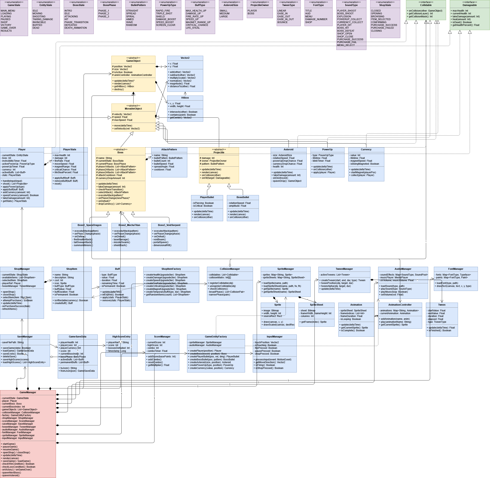
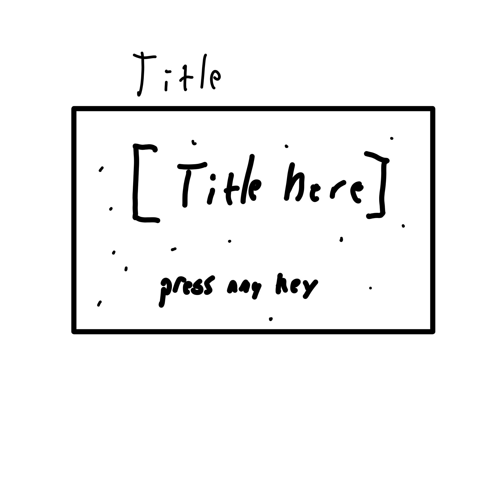
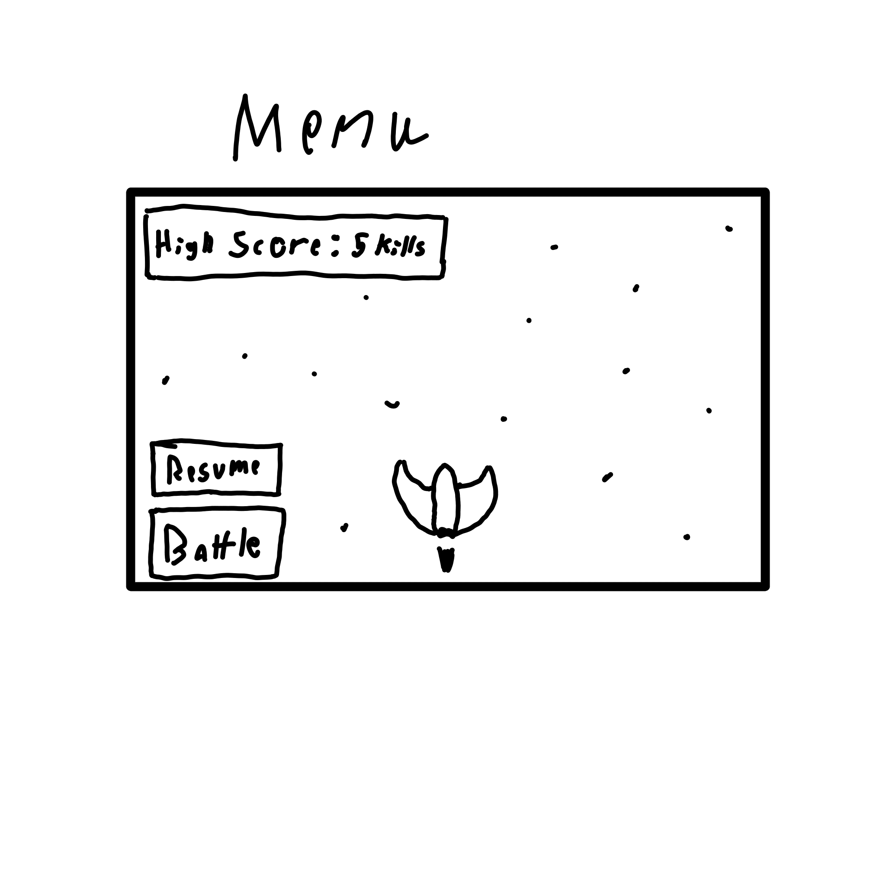
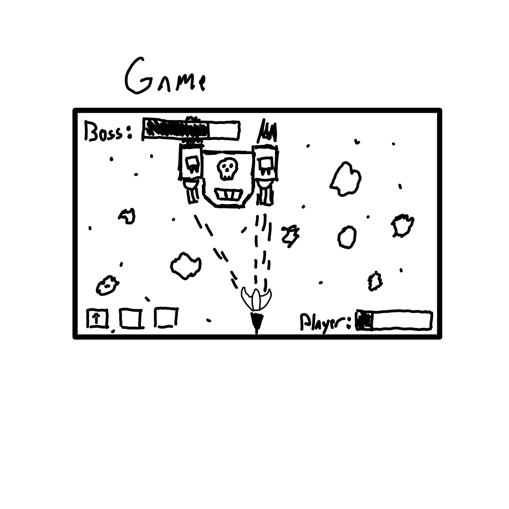
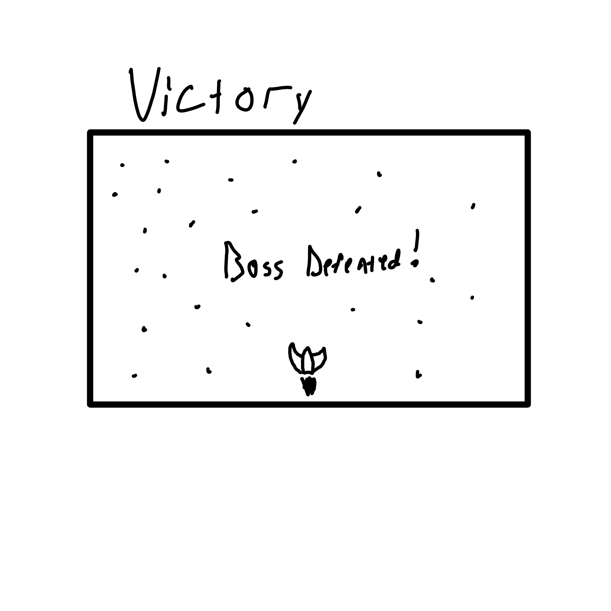
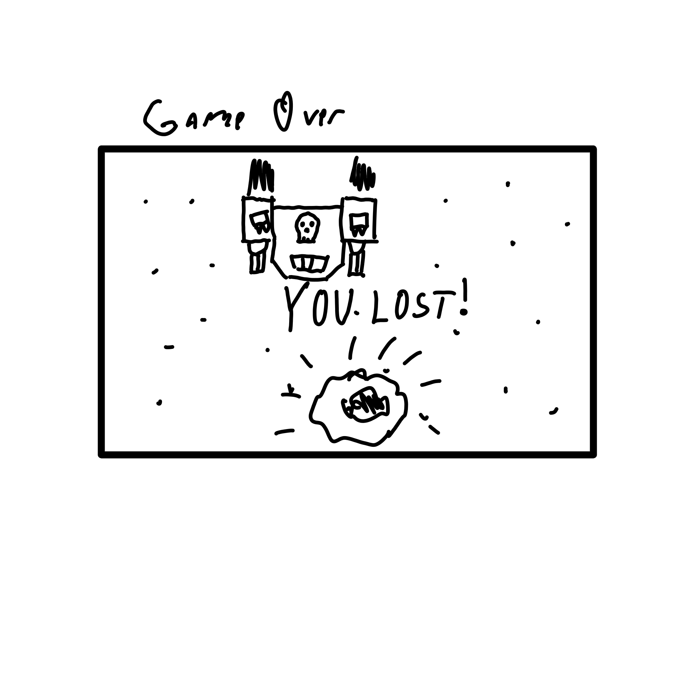

# Final Project

-   [ ] Read the [project requirements](https://vikramsinghmtl.github.io/420-5P6-Game-Programming/project/requirements).
-   [ ] Replace the sample proposal below with the one for your game idea.
-   [ ] Get the proposal greenlit by Vik.
-   [ ] Place any assets in `assets/` and remember to update `src/config.json`.
-   [ ] Decide on a height and width inside `src/globals.js`. The height and width will most likely be determined based on the size of the assets you find.
-   [ ] Start building the individual components of your game, constantly referring to the proposal you wrote to keep yourself on track.
-   [ ] Good luck, you got this!

---

# SPACE RAIDER XD

## ✒️ Description

Our game is a roguelike top-down shooter, where you control a spaceship and fight bosses. You control a small space ship, which you can move on the screen with wasd, while it shoots automatically.

The boss has a healthbar on the top of the screen, and the player has a healthbar in a bottom corner.

The bosses you face have lots of health and unique attacks and abilities for attacking the player. The bosses stay on the top of the screen, in most cases.

Only one boss will be implemented, the MechTitan, which can use:
- Laser Barrage, where it fires a bunch of projectiles of the player for a duration, with a spread
- Missile Swarm, where it fires 5 missiles that home in on the player and explode after a while
- Shield Bash, where it becomes invincible, dashes forward, comes back to the top of the screen and stops being invincible

While you fight the bosses, asteroids spawn on the screen, which can be destroyed by shooting them. Destroyed asteroids drop temporary power-ups.

The possible power-ups are:
- Rapid Fire, which increases the rate of fire of your weapon
- Triple Shot, which make your weapon fire 3 projectiles in a small spread instead of 1
- Shield, which makes your ship invincible
- Speed Boost, which makes your ship move faster
- Screen Clear, which clears all projectiles from the screen

When a boss is defeated, there's a small intermission delay, then the next boss spawns

For now, you fight increasing numbers of the same boss at a time (first one, then two at a time, etc.)

## 📃 Requirements

1. The user can move the ship with WASD.
2. The user ship fires automatically.
3. The user ship can pick up power-ups.
4. The user ship gets effects from picked up power-ups.
5. The user ship can get hit by asteroids, boss and boss attacks, which reduces it's health.
6. When the user ship health hits 0, it explodes.
7. The asteroids can be destroyed by player bullets.
8. When destroyed, the asteroids drop a power-up.
9. Power-ups disappear if they are not quickly picked up.
10. Power-up effects disappear after a certain time.
11. Boss position is locked on the y-axis (unless special attacks)
12. Boss follows player on the x-axis
13. Boss uses various special attacks, such as laser barrage, missile swarm and shield bash.
14. Laser barrage fires a stream of lasers at the player ship, with spread
15. Missile swarm fires a bunch of homing projectiles that explode after a set amount of time or on contact with the player ship.
16. Shield bash makes the boss invincible, fly down quickly, retreat slowly and stop being invincible.
17. The boss takes damage if hit by player projectiles (unless special attacks)
18. The boss explodes when it's health reaches 0.
19. If the boss dies, the victory screen is displayed.
20. If the player dies, the game over screen is displayed.
21. After the victory screen, another boss battle is initiated.
22. After the game over screen, the player is returned to the menu screen.
23. The number of bosses killed without dying is stored as score.
24. The high score is stored.

### 🤖 State Diagram

### 🗺️ Class Diagram

### 🧵 Wireframes

A nice introduction for the player.

-   _High Score_ shows you how many bosses you managed to kill in a row before dying.
-   _Resume_ loads your most recent save, so you can continue your fight.
-   _Battle_ starts a new battle from the beginning.

The game screen, the heart of the project. Health bar on top for boss, on bottom for player. In the left bottom corner are the power-ups. The power-up duration left will be displayed with a bar inside it (think vertical health bar).

Your goal is to get to this screen. Serves as a short intermission before the next boss.

Try to avoid this screen.

### 🎨 Assets

We used [app.diagrams.net](https://app.diagrams.net/) to state and class diagrams.

We also used [Krita](https://krita.org/en/) for wireframes

#### 🖼️ Images

-   Ship, boss, asteroids, projectiles and background are taken from [Starsector](https://fractalsoftworks.com/)
